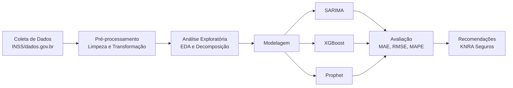

  

<h1 align="center">Análise Temporal de Acidentes de Trabalho no Brasil</h1>

  <strong>Ajuste estratégico de tabelas de seguros com base em dados do INSS</strong>

  
  
  
  

  
  &nbsp;&nbsp;

---

## Sobre o Projeto

Este projeto é parte da disciplina **Projeto Aplicado IV** do curso de **Tecnologia em Ciência de Dados EaD** da **Universidade Presbiteriana Mackenzie** (2026/01).

A proposta consiste em transformar dados públicos de acidentes de trabalho, disponibilizados pelo **Instituto Nacional do Seguro Social (INSS)**, em informações estratégicas para a atualização das tabelas de precificação da empresa fictícia **KNRA Seguros**.

O projeto está vinculado ao **ODS 9 – Indústria, Inovação e Infraestrutura**, contribuindo para a promoção de ambientes industriais mais seguros por meio da análise de dados.

## Objetivo

Desenvolver um produto analítico baseado em **séries temporais** que transforme dados brutos do INSS sobre acidentes de trabalho em **previsões e insights estratégicos**, apoiando a atualização precisa e preventiva das tabelas de seguros.

### Objetivos Específicos

- Análise exploratória dos dados identificando padrões temporais, regionais e setoriais
- Decomposição de séries temporais (tendência, sazonalidade e resíduos)
- Implementação e comparação de modelos: **SARIMA**, **XGBoost** e **Prophet**
- Avaliação com métricas MAE, RMSE e MAPE
- Dashboards interativos para visualização dos resultados
- Recomendações estratégicas para precificação de seguros

## Base de Dados

| Característica | Detalhe |
|---|---|
| **Fonte** | INSS – Portal de Dados Abertos ([dados.gov.br](https://dados.gov.br)) |
| **Período** | 2019 – 2024 (~6 anos) |
| **Granularidade** | Mensal |
| **Formato** | CSV (tabular) |
| **Complemento** | Anuário Estatístico da Previdência Social (AEPS) |

### Variáveis Principais

| Variável | Descrição |
|---|---|
| UF | Unidade da Federação de ocorrência |
| CNAE | Setor econômico |
| Tipo de acidente | Típico, trajeto, doença do trabalho |
| Faixa etária | Faixa etária do trabalhador |
| Sexo | Sexo do trabalhador |
| Mês/Ano | Período da ocorrência |
| Quantidade | Número de acidentes (**variável-alvo**) |

## Tecnologias e Ferramentas

  
  
  
  
  
  
  
  

## Cronograma de Entregas

| Etapa | Descrição | Data | Status |
|:---:|---|:---:|:---:|
| 1 | Definição do projeto e equipe | 01/03/2026 | ✅ Concluída |
| 2 | Referencial Teórico e Cronograma | 29/03/2026 | 🔄 Em andamento |
| 3 | Implementação Parcial | 26/04/2026 | ⏳ Pendente |
| 4 | Implementação e Entrega Final | 31/05/2026 | ⏳ Pendente |

## Metodologia

## 👥 Equipe

| Nome | Papel |
|---|---|
| **Aline A. Ferreira** | Integrante |
| **Karen Santos Souza** | Integrante |
| **Natallia Rodrigues de Oliveira** | Integrante |
| **Rafael Ferreira Eloi** | Integrante |

## Licença

Este projeto está sob a licença MIT. Veja o arquivo [LICENSE](LICENSE) para mais detalhes.

---

  <strong>Universidade Presbiteriana Mackenzie</strong> 
  Tecnologia em Ciência de Dados – EaD – 2026/01 
  Projeto Aplicado IV – Prof. Scalabrin

